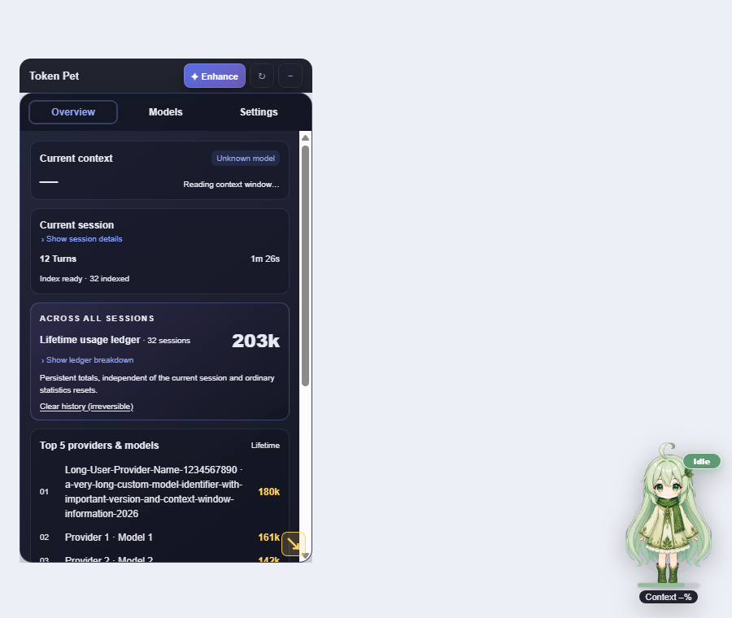
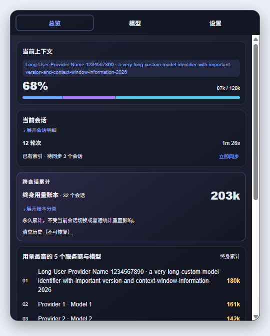
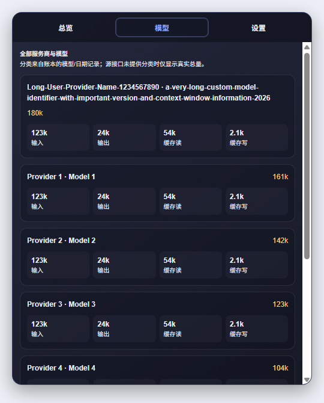
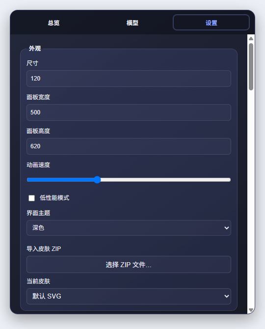
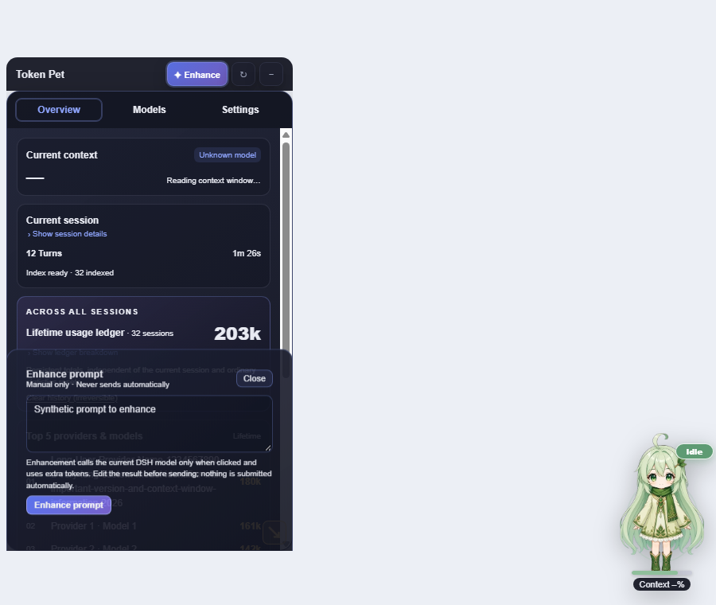
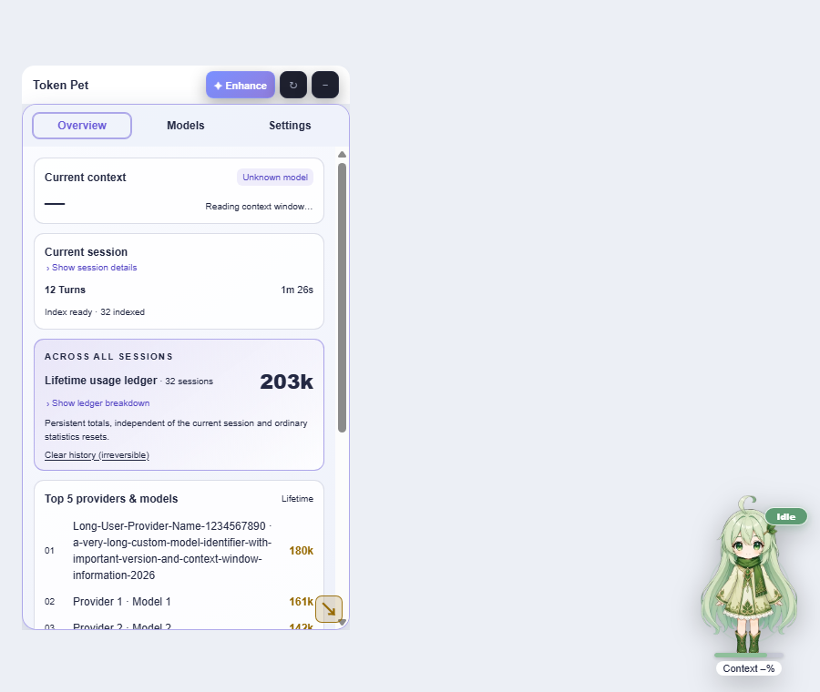
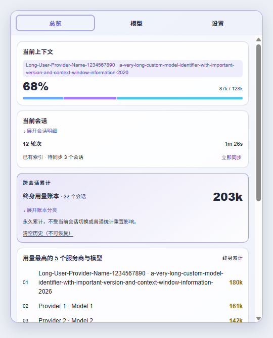
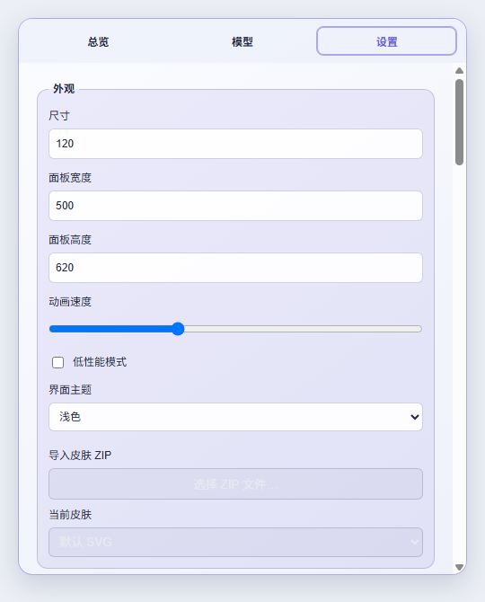

# DSH Token Pet

English · [简体中文](README.md)

A floating pet for **DeepSeek Harness (DSH)** with live runtime status, context usage, a lifetime token ledger, model breakdowns, trends, optional cost estimates, and user-triggered prompt enhancement.

> **Version 0.4.0:** dark/light theme switching, a visual price editor, cost estimates now **off by default** (opt-in), plus fixes for unreadable button labels caused by the host's dark-mode CSS and for the client bundle failing to load when the skin ZIP importer pulled in fflate.

## Screenshots

> Rendered from the plugin's **real components** in Chrome with sample data. No real conversation content is included.

### Dark theme (default)



| Overview | Models | Settings |
| --- | --- | --- |
|  |  |  |

Prompt enhancement drawer:



### Light theme

| Pet and panel | Overview | Settings |
| --- | --- | --- |
|  |  |  |

## Theme

**Settings → Appearance → Interface theme** (or DSH **Settings → 用量小宠物**):

- **Dark** (default) / **Light** — applies immediately to the stats panel, settings, prompt drawer, skin panel, trend maintenance and the floating header.
- Theming is driven by CSS variables; button labels use explicit colors so the host's dark-mode styles cannot make them unreadable.

## Cost estimates (off by default)

Cost information is **hidden unless you enable it**: **Settings → Cost & budget → Show cost estimates**.

- **Visual price editor** — edit the price table row by row (model / input / output / cache read / cache write) with add, delete, save and reset. Invalid rows are flagged and not written; no JSON editing required.
- Prices are local (USD per 1M tokens), keyed by model name, a `claude-*`-style prefix, or `*` as the fallback. Nothing is fetched from the network.
- Optional **monthly budget alert**: over budget, the pet plays a warning action (and chimes when the completion sound is on).
- Currency display can be switched between USD and CNY.
- Once enabled, the Overview shows this month's estimate and budget progress, and the Models tab shows a per-model estimate.

## Requirements and installation

- Node.js **22.19 or newer**.
- DSH Web or Desktop with its Web UI components enabled (`web` or `desktop` profile).
- This is a DSH plugin, **not a standalone desktop app**. Other agent platforms are not supported.

For the published release, open **DSH Settings → Plugin marketplace / Plugin management**, search for `dsh-token-pet`, and install it. Restart DSH or refresh its existing page as the host requires. Do not start another `dsh web` server if your DSH UI is already running.

Command line:

```sh
dsh plugin --profile desktop add dsh-token-pet@0.4.0
dsh plugin --profile web add dsh-token-pet@0.4.0
```

For local development, build the repository and install it as a local plugin (`dsh plugin --profile desktop add link:<absolute path>`). Building this repository alone does not update an already installed plugin. Follow the [Chinese installation and troubleshooting guide](README.md#安装) for profile-specific instructions.

## Switch to English

1. Click the pet to open its panel.
2. Open **设置 → 语言与通知 → 语言** and select **English**.
3. Alternatively, use the **用量小宠物** section in DSH Settings.

The pet, panel, prompt drawer, settings, accessibility labels and maintenance feedback update immediately, and both settings entry points stay synchronized. Chinese remains the default; this setting is manual, not inherited from the host language.

Your drafts, edited enhancement previews, custom templates, provider/model names and imported skin names are not translated or overwritten. Built-in enhancement templates follow the selected UI language, and the English default asks the model to preserve the prompt's original language.

## Panel and controls

- **Overview:** current-context/session cards, a cross-session Lifetime Ledger, provider/model rankings, today's hourly trend, the optional cost card, and a top-token-session ranking.
- **Models:** lifetime usage by provider and model, with per-model token breakdown and (when enabled) estimated cost.
- **Settings:** appearance (size, panel size, animation speed, theme, low-performance mode, skins), language and notifications, cost and budget, prompt enhancement, and advanced maintenance (trend index, export, action previews).
- Trends can be viewed per hour for today, or aggregated over the last **7 / 30 days**.
- Drag the pet and the panel independently. Drag the resize grip proportionally, or hold **Shift** to adjust width and height separately.
- Narrow layouts use compact header icons with accessible labels and tooltips. The panel has one main content scroller; editors can scroll internally.
- **Hide** closes the panel without removing the pet. **Enhance** opens a separate drawer without switching tabs.

The pet has twelve authored visual actions. Reduced motion, zero animation speed and low-performance mode can stop movement without changing its semantic status label.

## Completion sound

Go to **Settings → Language & notifications → Completion sound**.

- **Off by default**, persisted locally. Themes: **chime / pop / soft**, with a volume slider.
- When enabled, a short two-note chime plays once after a successfully completed reply in the **current conversation**.
- Individual tool results, cancelled or failed replies, session switches, archived/removed conversations and loaded historical completions stay silent.
- Turning sound off, switching conversations, losing the live session view, or unloading the plugin stops pending notes. Muted or blocked completions are never replayed later.
- Enabling the switch only unlocks audio; it does not play a test sound. **Preview sound** is an explicit test and does not enable automatic notifications.
- Browsers may require a click or key press after reload. If playback is blocked, try **Preview sound** and check the browser/OS audio settings. An unlocked audio context cannot guarantee that the OS output is unmuted.

Audio is synthesized locally using Web Audio: no downloaded audio files, remote service, system-notification permission, or new credential. Hosts without the required live turn-boundary data remain silent rather than guessing from running/tool status.

## Skins

- **Four built-in palettes**: Green Sprout, Blue Ice, Purple Mist, Orange Citrus. They only change colors — identity and actions stay the same.
- **Import a skin ZIP** from **Settings → Appearance → Skin import**. Extraction happens entirely in the client (`fflate`, bundled into the browser build), with entry-path validation and size limits (24 MiB ZIP / 64 MiB extracted). Installed skins live in IndexedDB and can be removed at any time.
- The manifest format, fallback chain and limits are documented in [docs/SKIN_SCHEMA.zh-CN.md](docs/SKIN_SCHEMA.zh-CN.md) (Chinese).

## Export

**Settings → Maintenance & advanced → Export usage data** writes a JSON snapshot (ledger, trend and session statistics) or a CSV of model/day cells. Statistics only — no conversation content.

## Prompt enhancement

Enable prompt enhancement in Settings, then open **Enhance** in the header. The local MIT `Prompt Optimizer` rules are always applied by default; there is no mode selector. Enhancement happens only on your explicit request. Review and edit the result before replacing/appending to the composer, copying, reverting, or sending it. Your existing custom template remains supplementary guidance and is not discarded.

An empty model preference follows the current DSH route, falling back to the host default model. Custom templates support `{{prompt}}`. Sending uses DSH's real composer actions; switching conversations revokes old actions and ignores late results. Changing UI language does not restart an in-flight request or erase its preview.

## Data and maintenance safety

- Panel reads use persisted snapshots. Opening or refreshing the panel does not trigger a full historical scan.
- Lifetime totals survive source conversation archival/deletion. Context occupancy and lifetime token usage are different measurements.
- Trend/index rebuilding is an explicit maintenance operation with confirmation, not part of ordinary refresh.
- **Clear history (irreversible)** permanently clears the Lifetime Ledger and cannot be undone by ordinary restore/refresh actions. Do not use it as routine troubleshooting.
- Previously persisted model-attribution errors are **not automatically migrated**. Back up and review an explicit migration strategy before upgrading affected installations; rebuilding history alone cannot reliably lower monotonic ledger totals.
- On hosts whose `sessionPersistence` does not expose `listSnapshots` (for example DSH `0.1.5-rc.x`), the hourly trend index is reported as **unsupported** in the maintenance card instead of failing repeatedly in the host log.

## Development and checks

```sh
npm ci
npm run typecheck
npm test
npm run audit:qpet-art
npm run build
npm pack --dry-run --json
```

Isolated browser verification (real Chrome, temporary `file://` fixture, synthetic data, fake AudioContext):

```sh
node scripts/verify-ui-local.mjs            # dark baseline
TP_THEME=light node scripts/verify-ui-local.mjs   # light theme
```

Set `CHROME_PATH` if Chrome is not in the default location. The script checks real component layout, language switching, panel controls and sound scheduling without accessing a real DSH session or playing through speakers. The 180-pixel case simulates constrained effective width; it is not an actual browser 200% zoom test. It does not install into or replace the running DSH GUI.

See [CHANGELOG](CHANGELOG.md) and the [handover notes](docs/HANDOVER.zh-CN.md) for release boundaries and remaining verification work.

## License

[MIT](LICENSE)
