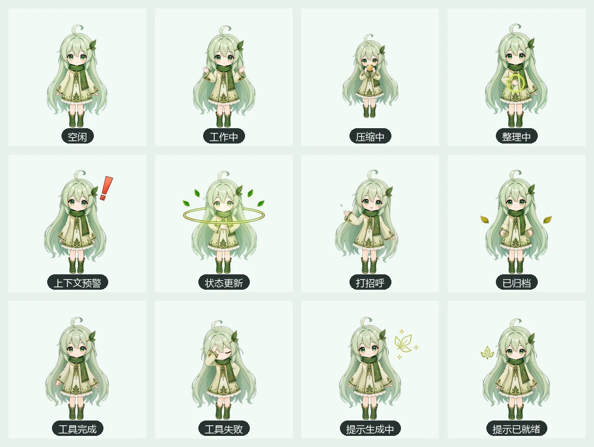
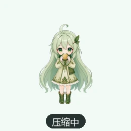

# DSH Token Pet · 用量小宠物

[](https://www.npmjs.com/package/dsh-token-pet)
[](https://github.com/Jimmy0123-ux/dsh-token-pet/actions/workflows/ci.yml)
[](LICENSE)

> DeepSeek Harness Desktop 的桌面宠物与 Token / 上下文可视化插件。

DSH Token Pet 将 DSH 当前会话、上下文窗口、工具调用、压缩流程和终身 Token 用量转化为一个常驻桌面的 Q 版角色。宠物会根据真实运行事件播放动作；浮窗提供上下文、模型、趋势和 Lifetime Ledger 等统计信息。

当前版本：`0.1.0` · Node.js `>=22.19`

## 项目用途

- 在不打开复杂监控页面的情况下快速查看当前上下文占用率；
- 用宠物动作反馈 DSH 是否空闲、工作、调用工具、压缩上下文或生成提示词；
- 查看跨会话、跨模型的终身 Token 用量与本日小时趋势；
- 将统计浮窗保持在桌面任意位置，并持久化位置与尺寸；
- 为 DSH 提供一个更直观、低打扰的运行状态入口。

## 功能与界面

| 功能 | 界面位置 / 效果 |
| --- | --- |
| 当前运行状态 | 宠物右上角状态牌：空闲、工作中、工具完成、提示生成中等 |
| 上下文占用 | 宠物下方显示 `上下文 xx%` |
| 当前会话数据 | 浮窗“总览”中的当前上下文、轮次、步数与模型耗时 |
| Lifetime Ledger | 浮窗“总览”中的终身用量账本与模型排行 |
| 本日趋势 | 按本地时区聚合的小时趋势折线图 |
| 模型明细 | 浮窗“模型”页，按服务商与模型展示累计用量 |
| 设置与维护 | 浮窗“设置”页，包含尺寸、动画速度、低性能模式、索引维护和动作预览 |
| 提示词增强 | 独立抽屉：预览、编辑、覆盖、追加、复制、撤回和直接发送 |

## 主要功能

### 宠物与状态反馈

- 单一固定角色身份，不随上下文档位更换角色或服装；
- 12 个正式逐帧动作，每个动作 32 帧、100ms / 帧；
- 固定脚底锚点与动作级水平锚点，避免跨动作漂移；
- multi-row 宽条带、ping-pong 循环和 one-shot 完整播放；
- 双图片缓冲：旧动作持续播放，新动作解码完成后原子接管；
- 用户预览与点击动作可立即抢占，后台事件在 40ms 窗口内合并；
- reduced-motion 与低性能模式下保留真实状态文案，可停用视觉运动。

### 上下文与用量

- 当前上下文占用率；
- 当前模型、轮次、步数和 Token 分类；
- 独立 Lifetime Ledger：归档或删除源对话后仍保留累计值；
- 每模型、每日期累计；
- 本日小时趋势与请求次数；
- 清空历史使用明确二次确认，并通过水位机制防止旧日志回灌。

### 性能浮窗

- 宠物与面板可独立拖动；
- 面板支持等比例缩放，按住 `Shift` 可自由缩放；
- 打开面板只读取持久化快照，不自动扫描历史或启动索引同步；
- 所有面板请求有 10 秒 deadline，失败后保留旧快照；
- 趋势后台刷新时仍展示已有数据；
- 索引增量维护由宿主后台协调器执行，用户也可显式“立即同步”。

### 提示词增强

- 仅在用户点击后执行，不自动增强；
- 未指定模型时跟随当前 DSH 会话路由，并回退到 `agentDefaultModel`；
- 支持自定义模板与 `{{prompt}}` 占位符；
- 结果进入独立编辑区，不会自动发送；
- 直接发送通过 DSH 官方 `inputActions` 写入并提交，不伪造 HTTP 请求；
- 插件日志不保存完整提示词。

## 宠物动作展示



### 动作循环演示


### 动作说明

| 动作 | 中文状态 | 触发场景 | 预览 |
| --- | --- | --- | --- |
| `idle` | 空闲 | 无任务时持续播放 |  |
| `working` | 工作中 | 请求运行、会话执行 |  |
| `eating` | 压缩中 | 上下文压缩开始 |  |
| `digesting` | 整理中 | 上下文压缩完成后的整理阶段 |  |
| `warning` | 上下文预警 | 上下文接近阈值或提示异常 |  |
| `evolve` | 状态更新 | 压力档位发生变化时的庆祝动作 |  |
| `click` | 打招呼 | 用户点击宠物 |  |
| `archive` | 已归档 | 会话归档或移除 |  |
| `tool-success` | 工具完成 | 工具调用成功 |  |
| `tool-failure` | 工具失败 | 工具调用失败 |  |
| `prompt-enhancing` | 提示生成中 | 提示词增强请求执行中 |  |
| `prompt-ready` | 提示已就绪 | 增强结果返回 |  |

## 安装与分享

### 本机源码 link 安装

```powershell
git clone https://github.com/Jimmy0123-ux/dsh-token-pet.git
Set-Location dsh-token-pet
npm install
npm run build

dsh plugin --profile desktop add link:<本项目绝对路径>
```

### 从 npm 安装

```powershell
dsh plugin --profile desktop add dsh-token-pet
```

### GitHub Release / tgz 安装

```powershell
# 直接安装公开Release
dsh plugin --profile desktop add https://github.com/Jimmy0123-ux/dsh-token-pet/releases/download/v0.1.0/dsh-token-pet-0.1.0.tgz

# 或安装已下载的本地文件
dsh plugin --profile desktop add C:\path\to\dsh-token-pet-0.1.0.tgz
```

宿主代码或客户端代码更新后建议完整重启 DSH Desktop。推荐使用 npm；开发调试使用源码 link。

## 开发与验证

```powershell
npm install
npm run typecheck
npm test
node scripts/qpet-asset-audit.mjs
# 可选：仅在本地保留 Review/h3-actions 生产源时运行
python scripts/check-strip-stability.py
npm run build
npm pack --dry-run --json
```

当前主要门禁：

- TypeScript host / client 双工程检查；
- 126+ 项 Node 测试；
- QPet 资源、固定身份、帧数、脚底锚点和播放器结构审计；
- click / prompt-enhancing 水平稳定性检查；
- 发布包去重检查（无 sourcemap、无重复独立条带）；
- 面板纯快照读取、后台同步、deadline 与双缓冲回归。

### 构建产物

```text
lib/index.js       # DSH 宿主插件
client/client.js   # 自包含 Web 客户端 bundle
```

发布包只包含 `lib`、`client/client.js`、文档和配置；生成源、Review 视频、ZIP、逐帧素材与 node_modules 不进入 npm 发布包。

## 项目结构

```text
src/index.ts                         宿主路由、索引与后台协调器
src/client/index.ts                  浮窗挂载、状态桥接和客户端请求
src/client/pet.tsx                   宠物 HUD 与状态展示
src/client/pet-action-player.tsx     双缓冲逐帧播放器
src/client/pet-action-sheets.generated.ts  内嵌 WebP 条带注册表
assets/pet/action-sheets/            可选宿主条带文件
docs/                                产品、制作与开发文档
scripts/                             生成、审计和稳定性脚本
tests/                               host / client / persistence 回归测试
```

## 数据、隐私与安全

- 统计数据来自本地 DSH 会话持久化层；
- 面板打开只读取持久化快照，不扫描历史；
- 后台索引采用单飞、分片和低频兜底；
- 提示词增强只在用户明确点击后执行；
- 不在插件日志中保存完整提示词；
- 皮肤与资源路径经过校验，不允许路径穿越、脚本或可执行内容；
- Review 目录中的生成源、视频、ZIP和个人审核素材不提交到仓库。

## 清晰度与性能边界

- 默认 `size=120`、DPR≤2 时使用 540px 源 cell 降采样显示；
- DPR=1 下 `size≤320` 不超过源分辨率；
- DPR=2 且大尺寸时会触及源图上采样上限；
- 播放器固定最多两个图片缓冲，并在交换后释放旧 `src`；
- 当前客户端内嵌条带以避免 host/client 更新时序不一致；发布包已移除 sourcemap和重复条带文件。

## 文档

- [产品与技术设计](docs/GDD.zh-CN.md)
- [开发清单](docs/DEVELOPMENT_CHECKLIST.zh-CN.md)
- [动作资源与运行时规范](docs/QPET_ACTION_PRODUCTION.zh-CN.md)

README媒体可通过以下命令重新生成：

```powershell
python scripts/build-readme-media.py
```

## 许可证

项目代码以 [MIT License](LICENSE) 发布。仓库内宠物运行时素材随本插件公开分发；若要在其他项目中单独复用美术素材，请先联系项目作者确认授权。
